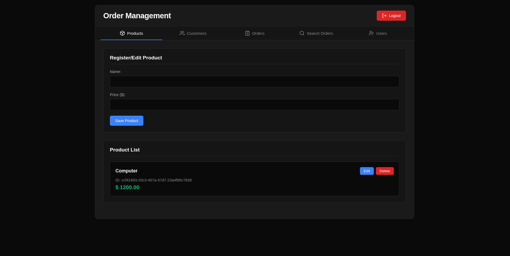

# Order Management API - Node.js

A full-stack order management system built with Node.js and vanilla JavaScript, featuring a RESTful API with JWT authentication, role-based access control, and a modern web interface for managing products, customers, and orders.


---



*Modern dark-themed interface for managing products, customers, and orders*

---

## Table of Contents

- [Overview](#overview)
- [Features](#features)
- [Architecture](#architecture)
- [Getting Started](#getting-started)
- [API Documentation](#api-documentation)
- [Frontend Interface](#frontend-interface)
- [Project Structure](#project-structure)
- [Technologies](#technologies)
- [License](#license)

## Overview

This project is a complete order management system with enterprise-grade security features that allows you to:
- **Secure authentication** with JWT tokens and cookie-based sessions
- **Role-based access control** (Admin/User roles)
- Manage a product catalog with prices
- Register and maintain customer information
- Create and track orders with multiple items
- Search and filter orders by customer or product
- **Persistent data storage** using LevelDB (embedded database)
- Interact through both API endpoints and a web interface

## Features

### Backend Features
- **RESTful API** with Express.js
- **JWT Authentication** with secure token management
- **Role-Based Access Control (RBAC)** - Admin and User roles
- **Password hashing** with bcrypt (10 salt rounds)
- **Cookie-based session management** with HttpOnly cookies
- **Protected routes** with authentication middleware
- **CRUD operations** for Products, Customers, Orders, and Users
- **Input validation** with detailed error messages
- **Advanced search** functionality for orders
- **CORS configuration** for security
- **LevelDB database** for persistent data storage
- **UUID-based ID generation** for all entities

### Frontend Features
- **Login system** with secure authentication
- **Session management** with automatic redirect
- **Modern, dark-themed UI** with responsive design
- **Tabbed navigation** for different sections
- **Real-time form validation**
- **Dynamic order management** with multiple items
- **Product and customer selection** via dropdowns
- **Order search** by customer or product
- **Error handling** with user-friendly messages
- **Edit and delete** functionality for all entities
- **Logout functionality** with session cleanup

## Architecture

The project follows a **layered architecture** pattern:

```
┌─────────────────────────────────────┐
│         Frontend (Web UI)           │
│    HTML + CSS + Vanilla JS          │
└─────────────────┬───────────────────┘
                  │ HTTP Requests (JWT Token)
┌─────────────────▼───────────────────┐
│      Authentication Middleware      │
│   (JWT verification, RBAC)          │
└─────────────────┬───────────────────┘
                  │
┌─────────────────▼───────────────────┐
│         Routes Layer                │
│   (productRoutes, orderRoutes,      │
│    customerRoutes, loginRoutes)     │
└─────────────────┬───────────────────┘
                  │
┌─────────────────▼───────────────────┐
│       Controllers Layer             │
│   (Business logic handlers)         │
└─────────────────┬───────────────────┘
                  │
┌─────────────────▼───────────────────┐
│        Services Layer               │
│   (Core business logic,             │
│    data validation, bcrypt)         │
└─────────────────┬───────────────────┘
                  │
┌─────────────────▼───────────────────┐
│      Repository Layer               │
│   (Data access abstraction)         │
└─────────────────┬───────────────────┘
                  │
┌─────────────────▼───────────────────┐
│         Database Layer              │
│   (LevelDB - Persistent storage)    │
└─────────────────────────────────────┘
```

### Layer Responsibilities

- **Authentication Middleware**: Verify JWT tokens, check user roles, manage sessions
- **Routes**: Define API endpoints and HTTP methods
- **Controllers**: Handle HTTP requests/responses and call services
- **Services**: Implement business logic, data validation, and password hashing
- **Repository**: Abstract data access operations
- **Database**: Persistent storage using LevelDB (embedded NoSQL database)

## Getting Started

### Prerequisites

- **Node.js** (v14 or higher)
- **npm** (v6 or higher)

### Installation

1. **Clone the repository**
   
   ```bash
   git clone https://github.com/williamalmeidadev/order-management-api-nodejs.git
   cd order-management-api-nodejs
   ```

2. **Install dependencies**
   
   ```bash
   npm install
   ```

3. **Configure environment variables**
   
   Create a `.env` file in the root directory:
   ```env
   # JWT Configuration
   JWT_SECRET=your-secret-key-here
   
   # CORS Configuration
   CORS_ORIGINS=http://localhost:3000,http://127.0.0.1:3000
   
   # Server Configuration
   PORT=3000
   ```

4. **Seed the database with an admin user**
   
   ```bash
   npm run seed
   ```
   
   This creates an admin user with the following credentials:
   - **Username**: `admin`
   - **Password**: `admin123`
   - **Email**: `admin@example.com`
   - **Role**: `admin`

5. **Start the server**
   
   For development (with auto-reload):
   ```bash
   npm run dev
   ```
   
   For production:
   ```bash
   npm start
   ```

6. **Access the application**
   
   Open your browser and navigate to:
   ```
   http://localhost:3000
   ```
   
   Login with the default admin credentials:
   - **Username**: `admin`
   - **Password**: `admin123`

## API Documentation

Base URL: `http://localhost:3000/api`

All API endpoints (except login) require authentication via JWT token sent as an HttpOnly cookie.

### Authentication

#### Login
```http
POST /api/login
Content-Type: application/json

{
  "username": "admin",
  "password": "admin123"
}
```

**Success Response (200):**
```json
{
  "user": {
    "userId": "uuid-here",
    "username": "admin",
    "role": "admin"
  }
}
```

**Note:** The JWT token is automatically set as an HttpOnly cookie.

#### Verify Token
```http
GET /api/login/verify
Cookie: token=<jwt-token>
```

**Response (200):**
```json
{
  "userId": "uuid-here",
  "username": "admin",
  "role": "admin"
}
```

#### Get Current User
```http
GET /api/login
Cookie: token=<jwt-token>
```

**Response (200):**
```json
{
  "id": "uuid-here",
  "username": "admin",
  "email": "admin@example.com",
  "role": "admin"
}
```

#### Logout
```http
POST /api/logout
Cookie: token=<jwt-token>
```

**Response (200):**
```json
{
  "message": "Logout successful"
}
```

---

### User Management (Admin Only)

All user management endpoints require admin role.

#### Get All Users
```http
GET /api/login/all
Cookie: token=<jwt-token>
```

**Response (200):**
```json
[
  {
    "id": "uuid-here",
    "username": "admin",
    "email": "admin@example.com",
    "role": "admin"
  }
]
```

#### Get User by Username
```http
GET /api/login/:username
Cookie: token=<jwt-token>
```

#### Create User
```http
POST /api/login/create
Cookie: token=<jwt-token>
Content-Type: application/json

{
  "username": "newuser",
  "password": "password123",
  "email": "user@example.com",
  "role": "user"
}
```

**Validation Rules:**
- `username`: required, non-empty string, unique
- `password`: required, non-empty string (hashed with bcrypt)
- `email`: required, valid email format, unique
- `role`: required, must be "admin" or "user"

#### Update User
```http
PUT /api/login/:username
Cookie: token=<jwt-token>
Content-Type: application/json

{
  "password": "newpassword123",
  "email": "newemail@example.com",
  "role": "user"
}
```

**Note:** Users cannot change their own role.

#### Delete User
```http
DELETE /api/login/:username
Cookie: token=<jwt-token>
```

**Note:** Users cannot delete themselves.

---

### Customers

All customer endpoints require authentication.

#### Get All Customers
```http
GET /api/customers
Cookie: token=<jwt-token>
```

#### Get Customer by ID
```http
GET /api/customers/:id
Cookie: token=<jwt-token>
```

#### Create Customer
```http
POST /api/customers
Cookie: token=<jwt-token>
Content-Type: application/json

{
  "name": "Jane Doe",
  "email": "jane.doe@example.com"
}
```

**Validation Rules:**
- `name`: required, non-empty string
- `email`: required, valid email format

#### Update Customer
```http
PUT /api/customers/:id
Cookie: token=<jwt-token>
Content-Type: application/json

{
  "name": "Jane Smith",
  "email": "jane.smith@example.com"
}
```

#### Delete Customer
```http
DELETE /api/customers/:id
Cookie: token=<jwt-token>
```

---

### Products

All product endpoints require authentication.

#### Get All Products
```http
GET /api/products
Cookie: token=<jwt-token>
```

**Response:**
```json
[
  {
    "id": "product-uuid-1",
    "name": "Product Name",
    "value": 29.99
  }
]
```

#### Get Product by ID
```http
GET /api/products/:id
Cookie: token=<jwt-token>
```

**Response:**
```json
{
  "id": "product-uuid",
  "name": "Product Name",
  "value": 29.99
}
```

#### Create Product
```http
POST /api/products
Cookie: token=<jwt-token>
Content-Type: application/json

{
  "name": "New Product",
  "value": 49.99
}
```

**Validation Rules:**
- `name`: required, non-empty string
- `value`: required, number > 0

**Success Response (201):**
```json
{
  "id": "product-uuid",
  "name": "New Product",
  "value": 49.99
}
```

**Error Response (400):**
```json
{
  "message": "'name' must be a non-empty string"
}
```

#### Update Product
```http
PUT /api/products/:id
Cookie: token=<jwt-token>
Content-Type: application/json

{
  "name": "Updated Product",
  "value": 59.99
}
```

**Response (200):**
```json
{
  "id": "product-uuid",
  "name": "Updated Product",
  "value": 59.99
}
```

#### Delete Product
```http
DELETE /api/products/:id
Cookie: token=<jwt-token>
```

---

### Orders

All order endpoints require authentication.

#### Get All Orders
```http
GET /api/orders
Cookie: token=<jwt-token>
```

#### Get Order by ID
```http
GET /api/orders/:id
Cookie: token=<jwt-token>
```

#### Search Orders
```http
GET /api/orders/search?customerId=<uuid>&productId=<uuid>
Cookie: token=<jwt-token>
```

**Query Parameters:**
- `customerId` (optional): Filter by customer UUID
- `productId` (optional): Filter by product UUID

#### Create Order
```http
POST /api/orders
Cookie: token=<jwt-token>
Content-Type: application/json

{
  "customerId": "customer-uuid",
  "items": [
    {
      "productId": "product-uuid-1",
      "quantity": 2
    },
    {
      "productId": "product-uuid-2",
      "quantity": 1
    }
  ]
}
```

**Validation Rules:**
- `customerId`: required, must exist
- `items`: required, non-empty array
- `items[].productId`: required, must exist
- `items[].quantity`: required, integer > 0

#### Update Order
```http
PUT /api/orders/:id
Cookie: token=<jwt-token>
Content-Type: application/json

{
  "customerId": "customer-uuid",
  "items": [
    {
      "productId": "product-uuid",
      "quantity": 5
    }
  ]
}
```

#### Delete Order
```http
DELETE /api/orders/:id
Cookie: token=<jwt-token>
```

---

## Frontend Interface

The web interface is built with vanilla JavaScript and features a modern, dark-themed design.

### Main Sections

1. **Login Page**
   - Secure login form
   - Session management with JWT
   - Automatic redirect to dashboard
   - Error handling with user feedback

2. **Dashboard (Authenticated)**
   - **Products Tab**
     - Create and edit products
     - View product list with prices
     - Delete products
     - Real-time price formatting

   - **Customers Tab**
     - Register new customers
     - Edit customer information
     - View customer list
     - Email validation

   - **Orders Tab**
     - Create orders with multiple items
     - Select customer from dropdown
     - Add/remove product items dynamically
     - Automatic subtotal calculation
     - Edit existing orders

   - **Search Orders Tab**
     - Filter orders by customer
     - Filter orders by product
     - Combined filtering support
     - Display order details with calculated totals

3. **User Session**
   - Persistent login with cookies
   - Automatic token validation
   - Logout functionality
   - Protected routes

### User Experience Features

- **Secure Authentication**: JWT-based login system
- **Session Persistence**: Stay logged in across page reloads
- **Automatic Redirects**: Redirect to login if not authenticated
- **Responsive Design**: Works on desktop and mobile devices
- **Real-time Validation**: Immediate feedback on form inputs
- **Error Messages**: Clear, actionable error messages from the backend
- **Smooth Transitions**: Tab switching with smooth animations
- **Visual Feedback**: Hover effects and button states
- **Data Persistence**: LevelDB ensures data survives server restarts

## Project Structure

```
order-management-api-nodejs/
├── data/
│   └── databases/            # LevelDB database files
│       ├── customers/        # Customer data
│       ├── orders/           # Order data
│       ├── products/         # Product data
│       └── users/            # User data
├── src/
│   ├── constants/            # Application constants
│   │   └── roles.js          # User roles (ADMIN, USER)
│   ├── controllers/          # Request handlers
│   │   ├── customerController.js
│   │   ├── loginController.js
│   │   ├── orderController.js
│   │   └── productController.js
│   ├── db/                   # Database configuration
│   │   └── index.js          # LevelDB initialization
│   ├── middleware/           # Express middleware
│   │   └── auth.js           # JWT auth & RBAC middleware
│   ├── public/               # Frontend files
│   │   ├── css/
│   │   │   ├── login.css
│   │   │   └── style.css
│   │   ├── js/
│   │   │   ├── auth.js       # Frontend auth logic
│   │   │   ├── dashboard.js
│   │   │   └── login.js
│   │   ├── pages/
│   │   │   ├── dashboard.html
│   │   │   └── login.html
│   │   └── index.html
│   ├── repositories/         # Data access layer
│   │   ├── customerRepository.js
│   │   ├── orderRepository.js
│   │   ├── productRepository.js
│   │   └── userRepository.js
│   ├── routes/               # API route definitions
│   │   ├── customerRoutes.js
│   │   ├── loginRoutes.js
│   │   ├── orderRoutes.js
│   │   └── productRoutes.js
│   ├── services/             # Business logic
│   │   ├── customerService.js
│   │   ├── loginService.js   # Auth & user management
│   │   ├── orderService.js
│   │   └── productService.js
│   ├── app.js                # Express app configuration
│   ├── seed.js               # Database seeder (creates admin)
│   └── server.js             # Server entry point
├── .env                      # Environment variables (create this)
├── .gitignore
├── package.json
├── LICENSE
└── README.md
```

## Technologies

### Backend
- **Node.js** - JavaScript runtime
- **Express.js** (v5.2.1) - Web framework
- **LevelDB** (classic-level v3.0.0) - Embedded NoSQL database
- **JWT** (jsonwebtoken v9.0.3) - Token-based authentication
- **bcrypt** (v6.0.0) - Password hashing
- **UUID** (v13.0.0) - Unique identifier generation
- **cookie-parser** (v1.4.7) - Cookie parsing middleware
- **CORS** (v2.8.5) - Cross-Origin Resource Sharing
- **dotenv** (v17.2.3) - Environment variable management
- **Nodemon** (v3.1.11) - Development auto-reload (dev dependency)

### Frontend
- **HTML5** - Structure
- **CSS3** - Styling with modern features
- **Vanilla JavaScript** - No framework dependencies
- **Fetch API** - HTTP requests with credentials

### Security
- **JWT Authentication** - Stateless token-based auth
- **HttpOnly Cookies** - Secure token storage
- **bcrypt Hashing** - Password encryption (10 salt rounds)
- **RBAC** - Role-Based Access Control
- **CSP Headers** - Content Security Policy
- **CORS Configuration** - Allowed origins whitelist

### Architecture Patterns
- **Layered architecture** with clear separation
- **Repository pattern** for data access
- **Service layer** pattern for business logic
- **Middleware pattern** for authentication & authorization
- **RESTful** API design

---

### Environment Variables

The application uses the following environment variables:

| Variable | Description | Required | Default |
|----------|-------------|----------|---------|
| `JWT_SECRET` | Secret key for JWT token signing | Yes | - |
| `CORS_ORIGINS` | Comma-separated list of allowed origins | No | Empty (allows all) |
| `PORT` | Server port number | No | 3000 |

## Database

The application uses **LevelDB** for persistent data storage:

- **Type**: Embedded NoSQL key-value store
- **Location**: `data/databases/` directory
- **Advantages**: 
  - No separate database server needed
  - Fast read/write operations
  - Persistent storage
  - Automatic data recovery
  - Low memory footprint
- **Collections**:
  - `users/` - User accounts and credentials
  - `customers/` - Customer information
  - `products/` - Product catalog
  - `orders/` - Order records

## Development

### Running in Development Mode

The development mode uses `nodemon` to automatically restart the server when files change:

```bash
npm run dev
```

### API Testing

You can test the API using:
- **curl**
- **Postman**
- **Thunder Client** (VS Code extension)
- **Insomnia**

**Example curl commands:**

**Login:**
```bash
curl -X POST http://localhost:3000/api/login \
  -H "Content-Type: application/json" \
  -d '{"username":"admin","password":"admin123"}' \
  -c cookies.txt
```

**Create Product (authenticated):**
```bash
curl -X POST http://localhost:3000/api/products \
  -H "Content-Type: application/json" \
  -b cookies.txt \
  -d '{"name":"Test Product","value":19.99}'
```

**Get All Products (authenticated):**
```bash
curl -X GET http://localhost:3000/api/products \
  -b cookies.txt
```

### Development Guidelines

- Follow the existing code structure and patterns
- Use meaningful variable and function names
- Add input validation for all user inputs
- Test authentication and authorization flows
- Keep security best practices in mind
- Update documentation for new features

## Security Features

- **JWT Authentication** - Secure token-based authentication
- **Password Hashing** - bcrypt with 10 salt rounds
- **HttpOnly Cookies** - Prevents XSS attacks on tokens
- **Role-Based Access Control** - Admin and User roles with permission checks
- **Protected Routes** - Authentication middleware on all sensitive endpoints
- **CORS Configuration** - Whitelist of allowed origins
- **Content Security Policy** - CSP header (frame-ancestors 'none')
- **Input Validation** - Comprehensive validation on all endpoints
- **Error Handling** - Generic error messages without exposing sensitive information
- **Session Management** - Automatic token verification and expiration (24h)
- **Password Policies** - Enforced minimum requirements

## License

This project is licensed under the MIT License - see the [LICENSE](LICENSE) file for details.

## Author

**williamalmeidadev**

- GitHub: [@williamalmeidadev](https://github.com/williamalmeidadev)
- Repository: [order-management-api-nodejs](https://github.com/williamalmeidadev/order-management-api-nodejs)

## Contributing

Contributions, issues, and feature requests are welcome!

1. Fork the project
2. Create your feature branch (`git checkout -b feature/AmazingFeature`)
3. Commit your changes (`git commit -m 'Add some AmazingFeature'`)
4. Push to the branch (`git push origin feature/AmazingFeature`)
5. Open a Pull Request

## Support

If you have any questions or need help, please open an issue in the [GitHub repository](https://github.com/williamalmeidadev/order-management-api-nodejs/issues).

---

**If you find this project useful, please consider giving it a star on GitHub!**
